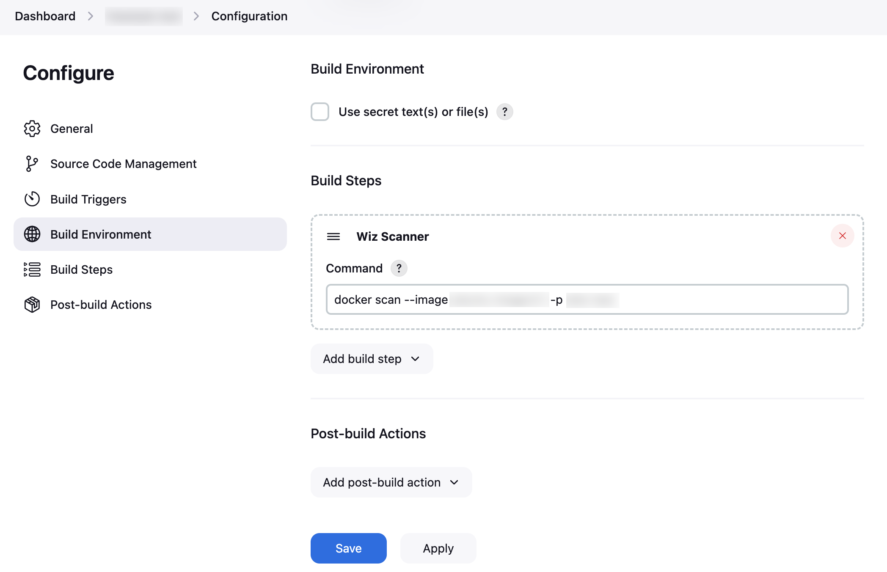
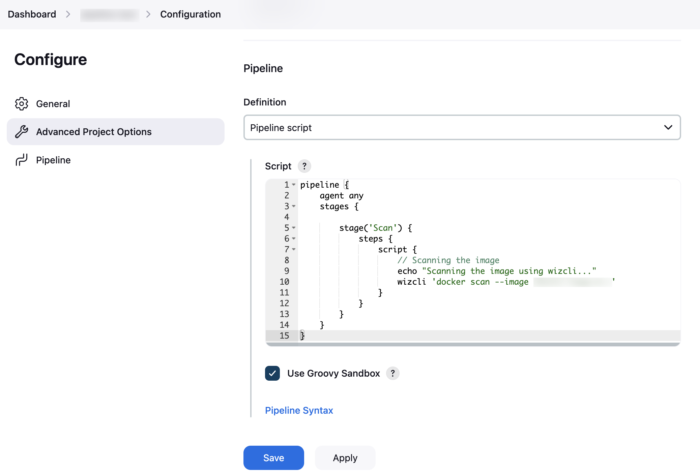
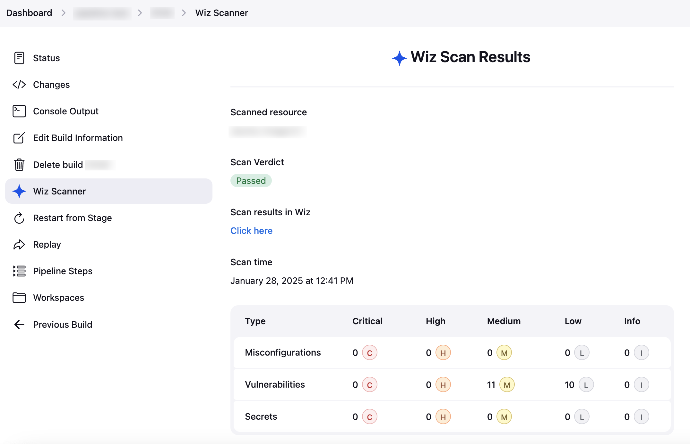

# Wiz Scanner Plugin 

## Introduction

This Jenkins plugin enables integrate Wiz CLI to detect sensitive data, secrets, misconfigurations, and vulnerabilities in container images, directories and IaC files.

## Prerequisites
- Access as an admin to your Jenkins account.

## Installation and Setup

1. Locate the Wiz CLI link relevant to your OS [here](https://docs.wiz.io/wiz-docs/docs/set-up-wiz-cli?lng=en#download-wiz-cli-to-a-linux-mac-or-windows-host) and store it in a safe place for future use. For example, the Wiz CLI download URL for Linux (AMD64) is https://downloads.wiz.io/wizcli/latest/wizcli-linux-amd64.
2. In Wiz, generate a service account by [following these steps](https://docs.wiz.io/wiz-docs/docs/set-up-wiz-cli?lng=en#cicd-pipeline-integration).
3. Log in to your Jenkins account.
4. Navigate to Manage Jenkins and click Plugins.
5. On the right menu, click Available plugins and search for "Wiz Scanner" using the top search bar.
6. Choose the Wiz Scanner and click Install on the top right.
7. Navigate to Manage Jenkins > System and scroll down to the Wiz section.
8. Fill in the Client ID, Secret Key (aka Client Secret), and Wiz CLI link that were previously collected.
9. (GovCloud/FedRAMP tenants only) Fill in the relevant environment variable. [Find your environment variable here](https://docs.wiz.io/wiz-docs/docs/set-up-wiz-cli?lng=en#govcloud-and-fedramp-only-configure-the-wiz_env-environment-variable).
10. Click Save.
11. Depending on the type of job, follow these steps:

#### Freestyle Jobs
1. On the dashboard, locate a freestyle job and select it.
2. On the left side menu, navigate to Configure > Build Steps.
3. Click Add Build Step and select Wiz Scanner.
4. Insert a Wiz CLI command (without the wizcli argument). [See the Use Wiz CLI page to learn how to build commands](https://docs.wiz.io/wiz-docs/docs/use-wiz-cli).

5. Click Save.

#### Pipeline Jobs

1. On the dashboard, locate a pipeline job and select it
2. On the left side menu, navigate to Configure > Pipeline.
3. Ensure the Definition is set to Pipeline script.
4. In the Script section, insert a Wiz CLI command (including the wizcli argument). [See the Use Wiz CLI page to learn how to build commands](https://docs.wiz.io/wiz-docs/docs/use-wiz-cli).

5. Click Save.

### Viewing Results
Run the job by clicking Build Now. When the build completes, scan results can be viewed under the **Wiz Scanner** tab.

## Contributing

To contribute to this repository, please review the [CONTRIBUTING](CONTRIBUTING.md) file.

Also, please refer to the Jenkins [contribution guidelines](https://github.com/jenkinsci/.github/blob/master/CONTRIBUTING.md)

## LICENSE

Licensed under MIT, see [LICENSE](LICENSE.md)

